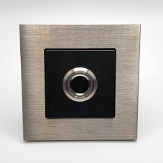

# OAM-AccessControl

OpenKNX Firmware und Anwendung zur OpenKNX-kompatiblen Einbindung von Fingerabdruck- und NFC-Lesern.

## Inbetriebnahme

Die Inbetriebnahme geht am einfachsten mit der [OpenKNX Toolbox](https://github.com/OpenKNX/OpenKNX/wiki/Verwendung-der-OpenKNX-Toolbox).

## Kompatible Fingerabdruckleser

Aktuell werden folgende Fingerabdruckleser unterstützt:
- R503 (Speicherkapazität: 200 Finger)
- R503S (Speicherkapazität: 150 Finger)
- R503Pro (Speicherkapazität: 1500 Finger)

Weitere Fingerabdruckleser können bei Bedarf angebunden werden.

## Kompatible NFC-Leser

Aktuell werden NFC-Leser basierend auf dem NXP PN7160 unterstützt.

## Kompatible Hardware

Die kompakte Steuerplatine kann vollständig in ein Standard-Schalterprogramm integriert werden. Hier als Beispiel mit Gira-Schalterprogramm in matt schwarz und Edelstahlrahmen:

<kbd></kbd>

Bei Bedarf können zwei zusätzliche Touch-Buttons links/rechts unten im Gira-Rahmen verbaut werden, welche z. B. zum Schließen/Öffnen einer Tür verwendet werden können. In der Mitte zwischen den beiden Touch-Buttons kann hinter einer kleinen Öffnung noch eine rot/grüne LED zur Anzeige des Status verbaut werden.

Ein NFC-Leser kann optional ebenfalls integriert werden.

Alle Infos zur kompatiblen Hardware findet sich [hier](https://www.ab-smarthouse.com/produkt/openknx-zutrittskontrolle-fingerprint-nfc/) oder bei Interesse einfach Kontakt per [E-Mail](mailto:info@ab-smarthouse.com?subject=[OpenKNX]%20Access%20Control) aufnehmen.